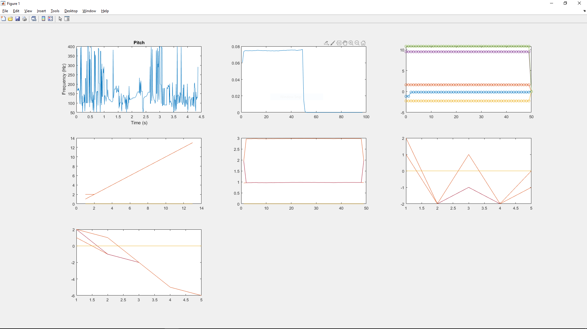

# Representation Learning and Nature Encoded Fusion Technique for Heterogeneous Sensor Networks 

This project is an implementation of the IEEE paper on Representation Learning and Nature Encoded Fusion Technique for Heterogeneous Sensor Networks 
paper number 10.1109/ACCESS.2019.2907256

The paper can be looked up [here](https://ieeexplore.ieee.org/document/8673763)

## Running the Program
Run the file driver.m that will internally call auxiliary functions and the beleif_propogation.m file to run and display the output.

The program will extract audio features, specifically the mfcc from a sample audio that has been attached with the project and
features from the frame of a video that has also been attached with this project.
 
### Output

Here the plots are on a grid of 3X3 and plot (x,y) refers to plot on the xth row and yth column starting the index from 
1 and from the top left.

__Plot (1, 2)__ represents the cross correlation between the probability distribution functions 
of the audio and video features. 

__Plot(1, 3)__ represents the sum of the cross correlation and the self correlation where the self correlation 
is the correlation of the audio probability distribution function with itself.

__Plot(2, 1)__ represents the belief propagation algorithm applied on the audio features 

__Plot(2, 2)__ represents the belief propagation algorithm applied to the video features

__Plot(2, 3)__ represents the belief propagation of the log likelihood series `[1, -2, -1, -2, -1]`

__Plot(3, 1)__ represents the belief propagation of the log likelihood series `[1, -1, -2, -5, -6]`
